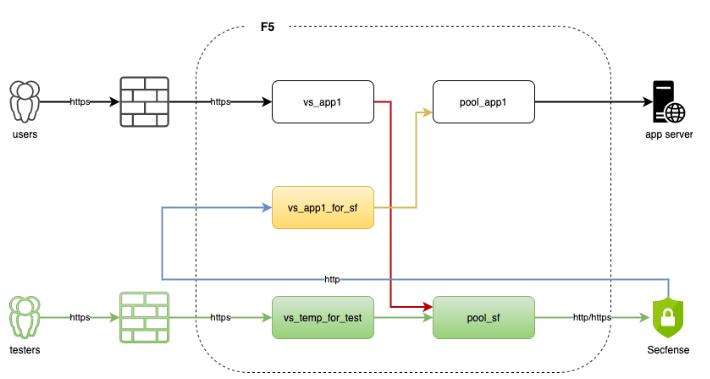
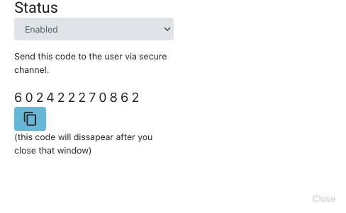

**Change Log:**

18.01.2024 – added information on non-standard ports (page 21 and

OPERATORS MANUAL

# Table of Contents

[Introduction [2](#introduction)](#introduction)

[Getting Started [3](#getting-started)](#getting-started)

[Installing the Broker
[3](#installing-the-broker)](#installing-the-broker)

[Clustering the device
[4](#clustering-the-device)](#clustering-the-device)

[(!)Enabling VRRP [5](#enabling-vrrp)](#enabling-vrrp)

[Software Upgrade [5](#software-upgrade)](#software-upgrade)

[Upgrading the single node setup:
[5](#upgrading-the-single-node-setup)](#upgrading-the-single-node-setup)

[Upgrading the clustered setup:
[5](#upgrading-the-clustered-setup)](#upgrading-the-clustered-setup)

[Deployment (type, instruction, success factors)
[5](#deployment-type-instruction-success-factors)](#deployment-type-instruction-success-factors)

[Deployment inside network.
[5](#deployment-inside-network.)](#deployment-inside-network.)

[Network configuration for typical deployments:
[8](#network-configuration-for-typical-deployments)](#network-configuration-for-typical-deployments)

[Inline, no load balancer:
[8](#inline-no-load-balancer)](#inline-no-load-balancer)

[Inline, with load balancer:
[8](#inline-with-load-balancer)](#inline-with-load-balancer)

[On a stick: [8](#on-a-stick)](#on-a-stick)

[Account hardening (adding MFA)
[11](#account-hardening-adding-mfa)](#account-hardening-adding-mfa)

[Licensing the device
[11](#licensing-the-device)](#licensing-the-device)

[GUI Overview [12](#gui-overview)](#gui-overview)

[Main View [12](#main-view)](#main-view)

[Dashboard [12](#dashboard)](#dashboard)

[Applications [12](#applications)](#applications)

[Roles [13](#roles)](#roles)

[Administrators [13](#administrators)](#administrators)

[Trust Groups [13](#trust-groups)](#trust-groups)

[Users [13](#users)](#users)

[Releases [13](#releases)](#releases)

[Audit Log [13](#audit-log)](#audit-log)

[Settings [13](#settings)](#settings)

[CLI Overview [14](#cli-overview)](#cli-overview)

[Docker Containers [14](#docker-containers)](#docker-containers)

[Administration Scripts
[15](#administration-scripts)](#administration-scripts)

[Log collectors [16](#log-collectors)](#log-collectors)

[Secfense health checks
[16](#secfense-health-checks)](#secfense-health-checks)

[Application Representation config files
[17](#application-representation-config-files)](#application-representation-config-files)

[Password Policy [17](#password-policy)](#password-policy)

[Quick Start [17](#quick-start)](#quick-start)

[Guides [21](#guides)](#guides)

[Configuring Applications
[22](#configuring-applications)](#configuring-applications)

[Nonstandard application options
[22](#nonstandard-application-options)](#nonstandard-application-options)

[MFA Policies [23](#mfa-policies)](#mfa-policies)

[Adjusting Application Headers
[24](#adjusting-application-headers)](#adjusting-application-headers)

[Adjusting the application learning mode
[24](#adjusting-the-application-learning-mode)](#adjusting-the-application-learning-mode)

[Adjusting logout behaviour
[25](#adjusting-logout-behaviour)](#adjusting-logout-behaviour)

[Microauthorizations [25](#microauthorizations)](#microauthorizations)

[Headers [26](#headers)](#headers)

[Learning [27](#learning)](#learning)

[Patterns Exception [28](#patterns-exception)](#patterns-exception)

[Logout Patterns [28](#logout-patterns)](#logout-patterns)

[Domains [29](#domains)](#domains)

[Enhancing user administration with LDAP
[30](#enhancing-user-administration-with-ldap)](#enhancing-user-administration-with-ldap)

[Full Site Protection
[30](#full-site-protection)](#full-site-protection)

[Adding own TLS Certificate
[30](#adding-own-tls-certificate)](#adding-own-tls-certificate)

[Preparing own translations and modifying the theme
[31](#preparing-own-translations-and-modifying-the-theme)](#preparing-own-translations-and-modifying-the-theme)

[Trust Groups [32](#trust-groups-1)](#trust-groups-1)

[(!)WebAuthn [33](#webauthn)](#webauthn)

[Custom Directives [33](#custom-directives)](#custom-directives)

[Other [33](#other)](#other)

[Protecting Single-Sign-On applications
[34](#protecting-single-sign-on-applications)](#protecting-single-sign-on-applications)

[Create bypass codes [34](#create-bypass-codes)](#create-bypass-codes)

[Deleting the application
[36](#deleting-the-application)](#deleting-the-application)

[Backup and Restore [36](#backup-and-restore)](#backup-and-restore)

[Adding roles for users
[37](#adding-roles-for-users)](#adding-roles-for-users)

[Adding Administrator or Support users
[37](#adding-administrator-or-support-users)](#adding-administrator-or-support-users)

[Adding third party identity providers
[37](#adding-third-party-identity-providers)](#adding-third-party-identity-providers)

[Adding Radius Server
[37](#adding-radius-server)](#adding-radius-server)

[Adding LDAP Server and remotely authenticated operators
[37](#adding-ldap-server-and-remotely-authenticated-operators)](#adding-ldap-server-and-remotely-authenticated-operators)

[Adding OIDC Server [38](#adding-oidc-server)](#adding-oidc-server)

[Password reset [38](#password-reset)](#password-reset)

[Adding another MFA (user perspective)
[38](#adding-another-2fa-user-perspective)](#adding-another-2fa-user-perspective)

[Enabling User Dashboard
[38](#enabling-user-dashboard)](#enabling-user-dashboard)

[Approving additional MFA
[39](#approving-additional-mfa)](#approving-additional-mfa)

[Using REST API [39](#using-rest-api)](#using-rest-api)

[Generating Support Pack
[40](#generating-support-pack)](#generating-support-pack)

[Whitelisting Secfense Authenticator
[40](#whitelisting-secfense-authenticator)](#whitelisting-secfense-authenticator)

[Common Issues [41](#_Toc155877093)](#_Toc155877093)

# 

# 

# Introduction

Secfense User Access Security Broker is an intermediary layer running
between the user and any web application. It provides multi-factor
authentication or other user access security without the need of
changing the protected application code. 

Secfense Broker works as a reverse proxy and intercepts traffic to
protected applications while adding its own overlay even before the
users’ credentials are passed, providing a seamless and user-friendly
experience for users while limiting the overhead for administrators to
absolute minimum.

The core functionality is contained within the Application
Representations () which contain all the
configuration required to properly facilitate second factor
authorization and provide a level of usability that would make the
day-to-day use of this application comfortable without any sacrifice to
the security.

# Getting Started

## Installing the Broker

Secfense Broker can run both as a physical device or virtual appliance.
The latter deployment is more common and will be used as a basis further
in this guide.

Secfense Broker is delivered as an image in Open Virtualization Format
(OVA file) and can be installed on any type of hypervisor, however we do
recommend VMware. The guest operating system running the appliance is
Alma Linux 64 bit.

The minimal requirements to run Broker are:

- 5.5 GB RAM

- 4 vCPU

- 40GB HDD

We recommend enabling the memory reservation option in VMware to avoid
potential issues with RAM being taken away from the containers.

Once OVA file is imported you will be informed about these requirements.
These values can be increased.

If your environment has a DHCP server and the VM has access to network
Secfense Broker would have an IP address assigned automatically. If that
is the case you can choose to use a terminal emulator of your choice to
connect to the system. Otherwise, you will need to finish the
configuration in the console.

- Log in to device using default credentials (username ***secfense***;
  password ***secfense***). First login will enable the configuration
  wizard.

- Enter Hostname (default: secfense)

- Select interface used for traffic.

- Secfense Broker runs on “one-legged” network design, which means it
  uses a single Interface and IP address to work.

- Confirm or add new IP address (remember the network mask)

- Confirm or change the gateway IP

- Confirm or change DNS address

At this stage the wizard asks to confirm network settings. If the IP
address changed from default and you are using SSH connection the
application will disconnect you and you will need to reconnect and
re-login.

- Configure the remote syslog IP (or skip, this can be added later)

- Configure NTP Server

Please note this is very important. Without proper time synchronization
TOTP (Time-Based One-Time Password) authentication might not work
properly.

At this stage Secfense Broker will start configuring containers. This
might take couple of minutes. Once the process is finished you will be
asked to change your password.

- Enter current “secfense” user password

- Type and retype new password

With these actions the installation is concluded, and you are able to
log in to Secfense Broker. You can choose to stay within the CLI scope,
however for most users it is advised to move to web browser. You can
reach the application by navigating to its IP address on TCP port 8002.
For example:

<!-- <https://10.10.2.34:8002/> -->

Default credentials are ***admin***/***123456***

You will be forced to change the default password after first login.

As for now the web browser should welcome you with a certificate error.
This is expected as the Broker uses certificate issued by Secfense CA
and your browser needs to be explicitly configured to trust it. You can
fix it either by adding Secfense CA to your trust stores or import your
own, trusted certificate to for admin panel.

You can download Secfense CA from /ca.crt path of the application, f.
ex.:

<!-- <http://10.10.2.34/ca.crt> -->

You can upload your own certificate for admin panel under the “Custom
SSL/TLS Certificate for admin panel” in the
section:


## Clustering the device

Please note – it is strongly advised to use separate hypervisors for
each Secfense Broker instance that would belong to the cluster.

In order to bind two Secfense Broker instances into a cluster make sure:

- both devices were installed separately (cloning an existing instance
  is not acceptable)

- both IP addresses can communicate with each other

- both devices are running the same software version

To cluster the devices please issue this command:

*bin/cluster_wizard*

Be careful when asked, whether current device is the main – otherwise,
in case you put a clean device on the cluster you risk of deleting all
configuration made up to this point.

## (!)Enabling VRRP

## Software Upgrade

Important: Before upgrading the device, we recommend to perform backup
of your device. The procedure is described here.

If you are running an instance with a customized look of the user
interface remember to backup the
/secfense/app/shared/internal_public_custom folder.

### Upgrading the single node setup:

This procedure described upgrading the Secfense Broker in a single node
installation. Please note that during this upgrade a short downtime in
service will occur.

1.  Download the file with new software

2.  Log in to Secfense Broker administration panel

3.  Navigate to
    
    section in the left-hand menu and enter the maintenance mode by
    clicking  in the upper right
    corner.

4.  Click “Add new release” – wait until the file is uploaded. Once the
    upload is finished a “install now” button will be available in the
    list of available releases

5.  Click “Install now” next to the chosen release. The process should
    take several minutes, and once it’s finished the version should be
    updated

6.  Exit the maintenance mode

Note: When performing a major upgrade (f.ex. 12.x.x to 13.x.x ) it is
advised to run the script bin/upgrade from CLI before clicking “Install
now” in GUI

### Upgrading the clustered setup:

1.  Download the file with new software

2.  Log in to Secfense Broker administration panel

3.  Navigate to section in the left-hand
    menu and enter the maintenance mode by clicking
     in the upper right
    corner.

4.  Click “Add new release” – wait until the file is uploaded. Once the
    upload is finished a “install now” button will be available in the
    list of available releases

5.  Click “Install now” next to the chosen release. The process should
    take several minutes, and once it’s finished the version should be
    updated

6.  Repeat steps from 2 to 5 on the second node

7.  Exit the maintenance mode on both devices.

Note: When performing a major upgrade (f.ex. 12.x.x to 13.x.x ) it is
advised to run the script bin/upgrade from CLI before clicking “Install
now” in GUI

In a scenario, where two devices are clustered it is impossible to exit
maintenance mode when devices are running different software version.

## Deployment (type, instruction, success factors)

### Deployment inside network. 

For Secfense Broker to work it needs to be placed within the
organization network between the user and application server. We
distinguish between 3 types of deployment based on application load
balancer placement in the infrastructure.

Inline – No Load Balancer


In this type of deployment Broker is placed directly before the
protected application. Such placement is achieved by altering the DNS
records related to protected applications to direct to Secfense Broker
IP addresses. Administrators need to keep in mind that any TLS
encryption needs to be performed on Broker itself, so either proper
certificates must be imported or Secfense CA must be added to clients'
trusted certificate store.

Even though Secfense Broker has some limited load balancing
capabilities, Inline deployment is not advised to be used with multiple
backend servers as no health monitoring would be performed which can
lead to broken sessions. 

Inline – with Load Balancer


When a load balancer is present in the network we can place the Broker
directly behind it. This case allows for easy production deployment -
users will keep using the same DNS records and load balancer will
perform TLS termination as always did. Secfense Broker would wedge
itself into the traffic and add its own security layer. 

Even though some load balancing is possible behind the Broker server it
is best to use this setup with a single end server rather than a pool. 

Please keep in mind that in any deployment that involves a load balancer
the Virtual Server, backend, backend, service (or any other
configuration item, depending on load balancer type) must have
X-Forwarded-For header added to the traffic. Application Representation
also needs to have an explicit information that Secfense Broker is
behind a proxy and the Load Balancer outgoing IP address(es) need to be
whitelisted:


On a stick


This configuration allows for Secfense Broker to be put “next to” the
production traffic. Proper rules on load balancer catch incoming traffic
to protected applications and instead of forwarding them to the end
servers it sends the packets to Broker for authorisation. Once
authorisation procedures are fulfilled Broker sends back the traffic to
a separate VServer designed just for this task which in turn forwards
the authenticated users to the application. 

In this setup all features of load balancing can be utilized (health
monitoring, load balancing algorithms, content switching etc.). Also,
all TLS operations are performed between User, Load Balancer and pool -
Secfense Broker has no need to contact the traffic members directly. 

This setup is preferred when there is a possibility of using a load
balancer in the network. 

Please keep in mind that in any deployment that involves a load balancer
the Virtual Server, backend, backend, service (or any other
configuration item, depending on load balancer type) must have
X-Forwarded-For header added to the traffic.

Application Representation also needs to have an explicit information
that Secfense Broker is behind a proxy and the Load Balancer outgoing IP
address(es) need to be whitelisted:


## Network configuration for typical deployments:

These instructions are aimed for a single protected application - to add
more applications follow these steps for each deployment.

### Inline, no load balancer:

For each application that would be protected by Broker change
appropriate DNS entries in order for them to resolve to Secfense Broker
IP address. Further configuration in Broker would direct traffic to
application servers. 

Keep in mind that client sessions would be terminated on Broker - this
means any TLS termination would also happen there. Please add Secfense
CA to trust store or maintain proper certificates in the Application
Representation.


In cluster setup use both Brokers IPs in DNS resolution to maintain high
availability or setup VRRP.

In order to prepare a test deployment, use a temporary test domain name.

### Inline, with load balancer:

For this setup no changes need to be made on frontend of the load
balancer. To move traffic to Broker, replace nodes in backend
configuration with Secfense servers. TLS would be terminated on the load
balancer.

To keep high availability in cluster setup, utilize load balancer rules
to configure active/standby solution using proper health checks
(described further in this guide)

For test purposes, create a new test frontend (independent from
production traffic) and use DNS to properly direct test users. 

### On a stick:

Follow these steps on load balancer to successfully deploy Secfense
Broker “on a stick” for a particular application:

Create a new frontend (VIP, Vserver - depends on type of load balancer)
that would be only reachable by Secfense Broker. Configure the backend
same as production fronted (forward traffic to application servers).


Create a pool that includes Broker servers - in order to maintain high
availability, utilize proper health checks and active/standby
configuration. 


To test the setup (without impacting production traffic) create a
separate test frontend for application (with the same settings as
production frontend, but use a different IP). Direct traffic from this
frontend to the newly created pool for Secfense Brokers. You can use DNS
to direct test users to this test frontend. 

While configuring the application in Broker GUI use frontend created in
step 1 as upstream URL. After these steps you should have a fully
functional test environment for a single application. 


In order to move above setup to production change the backend in
production Frontend to Broker backend. After this change all users
should have the same experience as users testing setup from point 4. 



To rollback production change restore original backend in production
fontend.


## Account hardening (adding MFA)

Secfense Broker only allows for FIDO2/WebAuthn compliant methods to be
added as multifactor authentication. Among those are:

- Internal Authenticators (like Apple Touch ID, or Windows Hello face or
  fingerprint authentication)

<!-- -->

- Security Keys (like Yubico U2F)

- Windows Hello Pin - Microsoft deployment of Windows Hello for machines
  without compliant face scanners or fingerprint readers

To add new WebAuthn device click the
icon
in the upper right corner and choose “Manage MFA”. Click the “Add new
WebAuthn device” and “Register Now” buttons. Follow the instructions on
screen relevant to your system and authentication type.  

## Licensing the device

To obtain information about your current license (expiration date and
user limit) go to
and
scroll down to the bottom of the page to section “Licensing”.

If the license is soon to expire, copy the Public Key and send it to
your Secfense support representative. You will soon receive a new key,
which will allow you to license the Broker for another period of time. 

Secfense Broker allows you to miss the expiry date by a month in order
to maintain the business continuity. After this grace period license
will inevitably expire and you will lose the functionality the Broker
provides. 

If the number of authorizations is exceeded, users attempting to
authorize through Secfense Broker will also get an information about
license error.

## GUI Overview

This section will briefly explain the available screens and their
typical use with the Secfense Broker GUI. Please note that this relates
to full view, which is designed for Super Admin users. Support users
will see a less detailed GUI which would be limited only to the parts
that are necessary for them to fulfil their role.

### Main View

This is the view you see when
you log in to the application. On the left side under Secfense logo you
will see current software version followed by the application menu.

In the upper right corner, you will see the counter to the timeout of
the current session (10 hours in this case) and the settings button for
your account. 

The centre of the screen will be used by items related to the current
Menu section. After logging in this section will show the Dashboard
view.

### Dashboard

Dashboard is divided into three sections:

- Application and users overview (showing total numbers for Application
  Representations you have access to)

- Graph representation of User Actions in the past 48 hours

- Tabular view of Authentication and Registration log showing overview
  of recent events.

### Applications

Initial view shows the list of applications already configured within
the Broker scope. 

In the filter bar you can search for particular application, sort the
list by name, creation or update time (both ascending and descending)
and change the list to more detailed view
( buttons). The default view is
list, but it can be switched to grid. 

On this screen you can also create or clone existing applications -
these actions will be described in detail in next sections of this
guide. 

### Roles

Secfense Broker supports role demarcation per application. This feature
allows for segmentation of admin functions for each application group,
or even customer and is achieved by configuring User Roles. These roles
act as policies which can later be assigned to particular user.

In the  Section of the Broker you
can view, add and delete User Roles.

Role can be assigned with Admin or Support privileges for as many
applications as are already configured within the system.

- “Admin” has a full access (read/write) to configuration of assigned
  applications and view audit logs related to their scope.

- “Support” also has access assigned applications, however in much more
  limited scope. They can view all settings for their application
  however they are not allowed to make any changes. Full scope of
  support role is described in the Support Manual document.

### Administrators

A list of all local users configured in one of previously set up roles.
You can add or remove an administrator. Change their role, password or
reset their second factor.

### Trust Groups

are adjustable sets of
applications which can use shared cookie to limit the amount of user
interactions with their chosen authentication method.

When user logs in to an application that is a part of a Trust Group,
they will not be asked to use their second factor in all other
application within this group until the configured timer expires.

### Users

By default, the list is empty and in order to administer a certain user
you need to know their full username (wildcards do not work here).

Once a user is identified you see whether they are trusted, and in which
application. You can perform admin action on this user like removal or
generating a bypass code if they rendered their second factor unusable.

This list is using a global scope. To find users registered in
particular applications please use the application scope

### Releases

On this screen you can add releases that would be further used for
upgrading the device.

You can also enter the maintenance mode, which allows for seamless
Secfense Broker upgrade when devices are working in a high availability
cluster

### Audit Log

View of last 1000 user actions that can be filter either by user, role
or affected domain. Older entries can be exported by filtering a range
of dates and clicking “Export” button.

### Settings

All the settings that do not fit in above categories and are related to
device and system configuration.

This page is divided into sections, each responsible for their own part
of configuration:

- Configuration – Export and import current configuration file (JSON)
  and change the timeout value for GUI

- RADIUS/LDAP/OIDC – turn on the use and add details for external
  provides of authentication services

- SMS Gateway – configure the gateway used to send GSM text messages

- Email Gateway – configure the gateway used for emails

- Webauthn – configure WebAuthn parameters for attestation

- Custom SSL/TLS for admin panel – by default Secfense Broker is
  validated by certificate issued by our own CA. Here you can upload
  your own certificate validated by CA of your choosing.

- Secfense Mobile Authenticator – in order to use our proprietary app
  compliant with FIDO2 all Secfense Broker instances need to be
  whitelisted within our system. The validation is done once per Broker
  deployment (it can be regenerated) and the administrator needs to send
  the ID and Public Key to Secfense representative in order to whitelist
  their instance of Secfense Broker.

- Support Pack – generate a package with logs and other diagnostic data
  in order to send it to Secfense support team.

- API access – Secfense Broker allows for full REST API usage. In order
  to create own webhooks the administrator needs to create their own key
  (which will be generated with the same privileges the person who
  created it had) to validate these commands. Please note once the key
  is created there is only one chance to see and copy it. Once you close
  the pop up with token details, you will not be able to extract the key
  again, and in case it’s lost you will have to generate a new one.

- Licensing – the last section shows details of current license. In
  order to relicense the Secfense Broker you need to copy the displayed
  Public Key and send it to Secfense. We will respond with a new license
  key which will prolong or expand your current license.

## CLI Overview

Secfense Broker Command Line Interface is available on port 22 via SSH
protocol. Even though a plethora of configuration and diagnostic options
is available only a subset of them is actually required to properly
administer the device and troubleshoot any potential issues.

Some level of Linux knowledge is required to operate Secfense Broker CLI
as the whole system is set on the foundation of Alma Linux system.

This manual will focus on CLI contexts important for day-to-day
operations of Secfense Broker.

### Docker Containers

Secfense Broker works as a set of cooperating Docker containers. These
containers have a different level of criticality to Broker operations,
and some failure points are acceptable. Some containers however are
vital - issues with those would result in complete system failure.
Containers and their basic information can be listed by the command
*docker ps.*


These containers and their purpose are as follows:

- bg-proc-system – handles all background operations – basically any
  operation that would not be finished within milliseconds is sent to
  this container for processing,

- admin – contain admin panel API and handles administration functions
  and procedures

- internalauth – this component is responsible for procedures related to
  conducting authorization

- user-dashboard – this one is responsible for user dashboard operations

- healthchecker – this container is responsible for gathering
  information related to appliance health. This information is usually
  served from the proxy container. More information about the health
  checks will be in the next section of this manual.

- trust – is responsible for creating trust between users and Secfense
  Broker. It accomplishes the goal of saving users that did properly
  enroll in the Second Factor followed by successful login to the
  protected application. This is designed as a separate container in
  order to detach it from the user context – no user can directly
  interact with trust container.

- proxy – container responsible for processing and relaying user traffic

- keydb – storage container for Secfense Broker

- admin-panel – nginx component which is responsible for serving REACT
  application – the admin panel on port 8002. Depending on the context
  it further relays traffic to other containers.

- fluentd – this container intercepts the log stream and processes it.

- node-exporter/prometheus/cadvisor/grafana – containers responsible for
  logs and metrics in relation to system operation.

### Administration Scripts

Several administration actions can be performed by specially crafted
scripts located in *bin* directory. These scripts are:

- *change_ip* – change the IP address of Secfense Broker

- *cluster_wizard* – used to configure a cluster between two Secfense
  Broker instances

- *healthcheck* – gathers information about device health. You can view
  the information (served by proxy container) by using one of two
  locations:

  - */secfense/healthcheck* – a basic healthcheck that returns “OK” when
    all critical components are working

  - */secfense/check_components* – a more sophisticated healthcheck,
    that probes the health of all containers and returns detailed JSON
    answer:
`````
> *{"health-check":\[{"service":"admin","alive":true},{"service":"admin-panel","alive":true},{"service":"fluentd","alive":true},{"service":"healthchecker","alive":true},{"service":"internalauth","alive":true},{"service":"proxy","alive":true},{"service":"trust","alive":true},{"service":"user-dashboard","alive":true},{"service":"bg-proc-system","alive":false},{"service":"keydb","alive":true},{"service":"cadvisor","alive":true},{"service":"node-exporter","alive":true},{"service":"grafana","alive":true},{"service":"prometheus","alive":true},{"service":"\_rsync","alive":true}\]}%*
`````

- *module_chronyd* – sets up a new NTP server

- *module_debug* – increase the verbosity of logs gathered on the
  device. It requires two answers – first one is related to trust,
  user_dashboard, admin, internalauth and healthchecker containers,
  second is for proxy container

- *module_fluent_syslog* – set up remote syslog server

- *module_ui* – script that exposes Nomad (container orchestrator) UI to
  port 14646. Please use with extreme care and vigilance

- *prepare_support_pack* – prepare a full support package for
  troubleshooting. The package is crafted in a way that no personal
  data, keys nor passwords are saved. This should be done using GUI
  however CLI is also possible. The command must be executed with a
  parameter (file name) and the package is saved as tar.gz in
  */secfense/jobs directory*.

- *update_infrastructure* – script used to commit any changes made
  manually to Nomad (Container orchestrator) definitions.

- *upgrade* – script used to commit the upgrader package – the upgrader
  container is changed each time a new software version is uploaded to
  the device. The script levels the environment and prepares it for
  upgrade. This procedure is done automatically when an upgrade is
  initiated from GUI.

### Log collectors

Administrator can navigate to folder */var/log/*containers in order to
find files that contain latest entries in the log files. Already rotated
files have dates appended to them, while the current log is in the file
with no appendix. Each container runs its own log file with the .log
extension.

There are two log collectors which are of potential interest to Secfense
Broker administrator:

- proxy.log – contains logs related to network traffic

- internalauth.log – contains logs related do particular authentication
  sessions


Log files are rotated daily and last for 5 iterations according to the
logrotate definition:

`````
*/var/log/containers/\*.log {*

*missingok*

*notifempty*

*rotate 5*

*daily*

*sharedscripts*

*postrotate*

*/usr/bin/systemctl kill -s HUP rsyslog.service \>/dev/null 2\>&1 ||
true*

*endscript*

*}*
`````

### Secfense health checks

The healthchecker container serves two levels of healthchecks via HTTP
protocol:

- basic healthcheck – served under
  <!-- <http://secfense_ip/secfense/healthcheck>. --> It returns OK when all
  critical components are working

- component healthcheck – served under
  <!-- <http://secfense_ip/secfense/check_components>. --> It returns detailed
  information (alive: true/false) for every Broker component:
`````
*{"health-check":\[*

*{"service":"admin","alive":true},*

*{"service":"admin-panel","alive":true},*

*{"service":"fluentd","alive":true},*

*{"service":"healthchecker","alive":true},*

*{"service":"internalauth","alive":true},*

*{"service":"proxy","alive":true},*

*{"service":"trust","alive":true},*

*{"service":"user-dashboard","alive":true},*

*{"service":"bg-proc-system","alive":false},*

*{"service":"keydb","alive":true},*

*{"service":"cadvisor","alive":true},*

*{"service":"node-exporter","alive":true},*

*{"service":"grafana","alive":true},*

*{"service":"prometheus","alive":true},*

*{"service":"\_rsync","alive":true}\]}%*
`````
Both healthchecks can be used for example to monitor Secfense Broker in
monitoring tools, or load balancer health checking scenarios by using
proper URLs.

### Application Representation config files

All application representation configurations are held (as separate
files) in this location:

*/secfense/app/shared/configs/\<application_name\>*

## Password Policy

All passwords created within Secfense Broker (Administrators, Support,
etc.) must strictly follow the password policy. Any new password created
must contain:

- At least 10 characters

- At least 1 capital and 1 lowercase letter

- At least 1 digit

- At least one special character
  ([~!@#$%^&\*\_-+=\`|(){}\[\]:;"'\<\>,.?/](mailto:~!@#$%^&*_-+=`|(){}[]:;"'<>,.?/))

Username must not be a part of this password.

## Quick Start

This part will present basic scenario of an “inline with load balancer”
application hardening. The application that would be hardened is
irrelevant, however it is important to notice that out of the box the
application is only configured to accept username and password. We will
use Secfense Broker to harden it with FIDO2 compliant multi factor
authentication.

Network part is already configured, and Secfense Broker is put behind
the load balancer representing following scenario:


Navigate to the application to verify whether the network works
properly. If the application is proxied by Secfense Broker, but no
application representation is configured you should see a white page
with Secfense logo instead of your usual application view.

In order to configure Application Representation in Secfense Broker you
will need following information:

- Domain name of the application – the application needs to have its own
  domain name. IP address will not suffice

- Default upstream URL – for inline configuration this would be the
  application server(s) IP address.

- Inbound port – TCP port on which Secfense Broker would listen for the
  traffic (usually 443 or 80) along with information whether the traffic
  is encrypted

- Outbound port – TCP port on which Secfense Broker would send the
  traffic to backend along with information whether the traffic is
  encrypted

- Proxy Network – in a load balancer scenario this would be the source
  IP of the packet leaving the load balancer (outbound interface). It
  can also be added as a Network with a CIDR mask.

To add new application in Secfense Broker go to Applications and click
“Create new application”. Input the following data:

- Name – a name of your choice that will uniquely describe the
  application

- Domain name – exact domain name without protocol declaration or URI

- Upstream URL – IP of the server where Secfense Broker would send the
  traffic. If DNS is present in the network you can click “resolve” to
  auto fill this field (make sure a proper resolution was created)

For standard set up this configuration would suffice. If you are aware
of any non standard ports, encryption or other features that might
influence the traffic please refer to the detailed configuration guide.

The representation of your application will appear in the list of
applications. At this point Secfense Broker is aware the application,
intercepts traffic to it, but since it has no instruction on how to
handle authentication it does not alter the traffic in any way and acts
as a simple reverse proxy. Navigate to the protected application to
verify that. Nothing out of ordinary should appear – let’s change that.

Once you clicked the representation of the application you can verify
the Basic settings and proceed with configuration. For the purpose of
this presentation, we will stick to basics.

In the “2<sup>nd</sup> factor” section set the options that fit your
scope on. We will use FIDO2/Webauthn and SF Authenticator. We leave user
enrollment policy as “Soft”. More on enrollment policies can be read
here.


Now, for the most important part. Secfense Broker employs a
sophisticated learning engine which allows for automated configuration
of most web-based applications (those rare cases, where automation is
not enough will be covered later in this guide). In order to start the
learning process, set the option to on and refresh the
browser window/tab with the protected application.

Once you see the “Secfense learning mode” bar in the bottom of the
screen you can be sure the configuration you’ve made so far is correct,
and Secfense Broker is ready to learn the login patterns of the
application.


To complete the learning process, we use a fake “probe” user. By
default, it is **inituser** but it can be changed in the advanced
settings (for example, when form validation is employed on the login
page, and the user must be in an email format). Use this username and
some random string for password and try to log in to the application.
Obviously, the attempt will not succeed, but it will provide valuable
information to Secfense Broker engine.


Go back to Secfense Broker GUI and click  in the “Authentication
patterns” section. A pattern candidate, represented by its Path and
Request type should appear.


Click  to enable this pattern and
turn the Learning mode off.

Once everything is done and the pattern is applied the section should
look like this:


After these steps the application is protected by Secfense User
Authentication Broker, and the next time you will log in to it you will
be asked to enroll in MFA:


# Guides

Configuring certain areas of Secfense Broker requires at least some
expertise in HTTP Protocol

`````
(<https://datatracker.ietf.org/doc/html/rfc2616>). Knowledge on how to
debug browser traffic (i.e. with the use of Developer Tools) is also
very useful. Training of the above is not in scope of this guide, user
is encouraged however to pursue this knowledge on their own.

The most efficient way to view HTTP traffic including requests that are
of interest in Secfense Broker scope is Developer Console – a feature
built in most browsers.

You turn on the console by pressing F12 (in Chrome, Firefox or Edge).
Describing the functionality of Developer Console is not part of this
manual.
`````
## Configuring Applications 

The core of Secfense Broker purpose is protecting web applications. A
simple set up was already explained it the Quick Start section of this
document. Next sections of this guide will perform a deep dive into more
detailed tweaking and adjusting configuration. This will help not only
in manual configuration of the rare cases, where automated learning
could not identify proper settings, but will also enhance user
experience and provide more security to your environment.
`````
All examples used in the below guide would be based on an instance of
Zammad (<https://zammad.org>) as an example protected application,
however it is not really important which application is protected as
long as it “speaks” HTTP.
`````
Please keep in mind that out of the box Secfense Broker is using TCP
ports 80 and 443 to listen for traffic. If any other port is needed
additional actions must be performed.

### Nonstandard application options

Apart from typical application settings described in the Getting Started
part of this guide an operator can set additional options for
nonstandard configurations under “Advanced Options” while creating
application representation.


- “SSL Redirect” and “Ignore letters capitalization” are enabled by
  default. The first options terminate the TLS encryption on inbound
  traffic and re-encrypts it when the traffic leaves the device.
  Capitalization ignoring can be turned off when for some reason upper
  and lowercase letters do make the difference in the hostname.

- “Normalize usernames to include domain” – this changes the username
  into username@domain

- “Use non-standard configuration (ports and encryption)” allows you to
  define on which port the Broker should listen for the traffic and
  which port should be used for outbound traffic to the application and
  whether the traffic should be encrypted or not. By default (with the
  “SSL Redirect” option it will be “443” and “yes”

- Finally “Enable Kerberos support” allows you add a keytab file and add
  another layer of protection for SSO applications

### MFA Policies

Secfense Broker allows for several means of providing 2<sup>nd</sup>
factor to your protected applications. We do encourage to use
FIDO2/Webauthn based authentications, however other are also available:

- FIDO2/Webauthn - FIDO2 compliant means of authentication like physical
  U2F keys, Windows Hello or Apple Face/Touch ID

- TOTP – Time-based One Time Passwords allow to use 3<sup>rd</sup> party
  authenticators like Google Authenticator

- RADIUS – allows to configure 3<sup>rd</sup> party Radius service as an
  authentication provider

- SF Authenticator – Enables the use of Secfense proprietary application
  available for free in App Store or Google Play. Secfense Authenticator
  is compliant with FIDO2 standard

- OIDC Profiles – allows to use 3<sup>rd</sup> party Open ID Providers

- SMS/Email – once a SMS or email Gateway is configured in the Settings
  Secfense Broker can send messages with authentication code.

Particular users can be added as those required to use a certain MFA by
clicking “Forced users” next to 2<sup>nd</sup> factor. Forced users can
be also defined using and LDAP link.

Above means of authentication must be used in conjunction with User
enrollment policies. These policies define how strict is the application
when it comes to forcing users to enroll in MFA. Secfense Broker offers
following policies:

#### SOFT

Users are encouraged to upgrade their security. Once a new user logs in
to the protected application, they are presented with Secfense overlay
and options to enroll in MFA, however they are offered a possibility to
Skip and choose to enroll at a later time.

#### HARD

The „Skip” option is taken away and users must enroll in MFA if they
wish to proceed to the protected application.

#### OPT-IN

Both „Soft” and „Hard” enrollment policies can be used with “opt-in”
policy. This policy allows to define which usernames would be subjected
to MFA enrollment. Opt-in policy alters the behavior of previously
“Hard” and “Soft” for users that are not predefined:

- “Opt-in soft” – only catches the pre-defined usernames, which are
  offered the possibility to enroll in MFA and ignores anyone else.
  Users not caught by the policy have the same user experience as before
  and MFA does not affect them.

- “Opt-in hard” – pre-defined usernames are forced to enroll in MFA and
  everyone else is blocked from using the application.

Use of the “Opt-in” policies requires configuring the users that would
be affected. Secfense Broker offers 3 ways of performing this task.

- Adding OPT-IN users manually

> Once an „Opt-in” policy is selected in the Main Configuration another
> tab appears in the Application Representation config – “Opt-in Users”.
> Each application Administrator or Support can add users within this
> tab by using “Create Opt-in User” button at the top right corner. To
> add “Opt-in” user just enter the expected username and click “Create”.
>
> Administrator or Support can also delete the previously added user
> within this page.

- Configuring OPT-IN Users from LDAP

> In order to be able to use LDAP as a source of “Opt-in” users an
> administrator must configure LDAP in the Settings menu. Once the LDAP
> connection is ready a new section will appear in the Advanced
> Configuration – “LDAP sync”. An administrator can add a DN from which
> Secfense Broker would fetch the users for “Opt-in” policies.

- Using WebHooks to add OPT-IN Users

> Final method to add „Opt-in” users is by taking the advantage of REST
> API. When an API Access token is created with sufficient privileges a
> REST API URL (webhook) can be crafted that performs the same action as
> “Create” button in the adding “Opt-in” users’ section of the
> configuration. Some proficiency with REST API and HTTP protocol is
> needed to craft said URL.

### Adjusting Application Headers

Some applications may require a deviation from standard learning
procedure in order to fully cooperate with Secfense Broker. In the
“Headers” Section of Advanced Configuration these headers can be
fine-tuned to fit the particular application purpose.

- GZIP – enables compressed headers

- HSTS – enables HTTP Strict Transport Security

- Custom CSP – allows to enter Custom Security Policy to allow Secfense
  Broker traffic

- X-Forwarded-Proto – chooses the type of X-Forwarded-For header

The choice of above options must be considered based on traffic
analysis.

### Adjusting the application learning mode

#### Changing the default user for learning mode

Some applications make use of form validation when user is entering
their credentials. Such validation typically checks for certain
properties of the username – and may require, for example for an email
address to be entered before it can proceed with the authentication.

Secfense Broker uses a “probe” user with the name of “inituser” by
default to learn the applications login behavior. This username can be
changed in the Learning section of Advanced configuration and can be set
to any string that would pass the form validation.

#### Confirming successful login

By design a user is only saved as “Trusted” within the Broker database
when a successful login is recognized. This means that a user not only
has to complete second factor enrollment, but he also needs to
successfully login to the application.

This prevents a malicious actor to automate unsuccessful logins and
expire the Broker license.

Most applications do have very predictable login behavior and fit
perfectly within the “out-of-the-box” Secfense Broker configuration.

Some on the other hand tend to deviate from set standards. The
“Learning” section in the Advanced Configuration allows to teach the
Broker to recognize these behaviors by configuring certain responses of
protected application.

In order to recognize these patterns, an operator needs to perform a
successful login and verify within the traffic what kind of HTTP
response the application presents right after this action. Few option
can be chosen:

- Response code – define which HTTP answer is used to respond to
  successful login. By default any answer can be used as a success
  factor.

- Successful login response body – identify a unique part of the
  response page that can be used as an indicator of successful login

- Successful login redirect location – identify where user is being
  redirected (30X redirection) after successful login

- Cookie set name – if a cookie is set for a successfully logged in user
  enter the cookie name in the text box.

In all above cases a regex expression can be used to further adjust the
application behavior.

### Adjusting logout behaviour

### Microauthorizations

Microauthorizations provide a possibility to add another layer of
protection to certain, vital parts of protected application. This
feature is triggered, when pre-configured HTTP requests are caught, and
it is in Operators scope to identify said requests.

Please note that even though Microauthorizations can, is some cases
protect whole subpages, it is not an advised use case for this feature,
as it should be used to protect certain actions (like for example
pressing a “Submit” button).

Additional benefit provided by Microauthorizations is the possibility to
involve a 3<sup>rd</sup> party (like a supervisor) to approve protected
action adding a 4-eye principle to the authorization process.

Please note – it is not advised to use Microauthorizations in an
application where SOFT enrollment policy is used. In order for this
function to work, a user whose actions need to have another layer of
authentication needs to be already enrolled in MFA. If they skip the
enrollment, and then try to use a protected action an error “User not
set” would occur. Using a “HARD” policy prevents this scenario from
happening.

#### Adding a Microauthorization

In order to add a Microauthorization you need to catch an event, that
will trigger the Broker to protect the action. The best way to identify
this event is to utilize a developer console and check what request is
being made right after executing the option you wish to protect.

In below example I intend to protect an action that happens once a
“Create” button is clicked. In the Network inspector of developer
console, I can see that this is the first request


Out of this output one can determine:

- It’s an asynchronous request (XHR)

- The method is “POST”

- The requested URL is
  [https://servicedesk.cld.secfense.com**/api/v1/tickets**](https://servicedesk.cld.secfense.com/api/v1/tickets)

You can also view the Payload of this request in order to find any
unique strings that might also identify this as your request of
interest. For this purpose only the previously mentioned information are
required.

Navigate to your Secfense Broker and open the “Microauthorisation” tab
in the Application Representation you want to configure.

Click “Create new Microauthorization” in the upper right corner and fill
out the required fields:

- Name – a unique name for the action

- Method – Choose from POST, GET, PUT, PATCH, DELETE based on the
  information from Developer Console

- Strategy – choose from XHF, FETCH or FORMS based on the information
  from Developer Console

- URI Regexp – enter the URI the requests direct to (it can be just the
  URI, of for more versatile solutions a Regexp formula is also an
  option)

- Payload regexp – if no payload is identified as unique for this
  request delete the default entry. If you identify a proper, unique
  part of this request payload enter this here.

- Policy – Choose from Owner (the user can approve this request by
  himself) or Supervisor (another, enrolled in MFA user needs to approve
  this action).

You can choose to configure the Microauthorization, but leave it
disabled for the time being by switching the control next to “Active”.

Click Create – once the Microauthorization is created it receives a
unique ID and its policy is already in effect.

On the same page you can also Remove, Edit or Disable/Enable previously
created Microauthorizations.

#### Adding a Supervisor

If you choose to create a Microauthorization with the Policy
“Supervisors” you need to specify who are the users authorized to
approve Microauthorization requests. A Supervisor needs to be a user
already enrolled in MFA via Secfense Broker.

Go to Supervisors tab in the Application Representation and click
“Create Supervisor” in the upper right corner.

Enter the login of the Supervisor (please take care not to make any
mistakes) and click Create.

Once finished, each time a user would be caught by the
Microauthorization with Supervisors policy a specified User(s) would
have to approve their request by using their own MFA method.

Supervisors can also be added via an LDAP link.

### Headers

Secfense Broker learning patterns and algorithms responsible for
authorizations are based on typical login behaviors observed in most web
applications. Some applications however do deviate from those standards,
and that is where some finetuning is required.

One of many options that can be adjusted within the Application
Representation configuration are headers.

In the Headers section of Advanced Configuration, you can configure:

- GZIP – should be used when the web application makes use of “gzip”
  Content-Encoding

- HSTS – choose this option when a HTTP Strict Transport (a standard
  that ensures browsers always connect to website over HTTPS) is used.

- Custom CSP – some web applications use a Content Security Policy
  Header which is an added layer of security preventing Cross Site
  Scripting or Data Injection attacks. Secfense Broker might be falsely
  recognized as such attack by CSP. In order to prevent it identify a
  CSP header in the Developer Console and paste it contents to the
  Custom CSP box in the Advanced Configuration.

Typical case, when a CSP is interfering with Broker operation is when
you enable Learning Mode for an Application Representation, but the
banner indicating that mode is active does not appear. You can check
whether a CSP is involced by examining the Console in the Developer
Console

CSP can be configured as a report only – which will result in error
generation, but will not block the traffic once the policy is violated.
It is up to the operator to choose whether it is required to create a
pattern for such policy.

For test purposed an operator can use this CSP that basically overrides
any restrictions:

*default-src \* 'unsafe-inline' 'unsafe-eval'; script-src \*
'unsafe-inline' 'unsafe-eval'; connect-src \* 'unsafe-inline'; img-src
\* data: blob: 'unsafe-inline'; frame-src \*; style-src \*
'unsafe-inline'; worker-src \* data: blob: 'unsafe-inline'        *

We do not advise however to keep this in a production environment, and
craft a more secure CSP for normal use.

- X-Forwarded-Proto – an X-forwarded-For header must be used in
  cooperation with Load Balancer deployments. Usually an automated
  identification is enough but in some cases an operator must decide
  whether this header is used in conjunction with HTTP or HTTPS.

### Learning

There are two separate features an operator can configure within the
Learning section of advanced configuration. In order to understand them
we need to define two scopes of application learning:

- Initial learning mode used to identify Authentication Patterns

- Learning the behavior of the application during certain actions.

The first scope is used only during the initial configuration. The
second scope is broader and is used to define the whole user experience
and, in some cases, – basics of the multifactor authentication.

First configuration item in the Learning section is connected with the
first scope. By default, Secfense Learning Mode uses the probe user
“inituser” to follow the authentication patterns of protected
application and apply proper settings. In some cases, however the form
used to input username and password can be subjected input validation
and, for example, accept only emails as username. In that case enter an
acceptable value in the text box next to “Learning Mode” and click save.
From now on the Broker will be listening for the specified username as a
probe.

Next configuration items in the Learning section are related to
recognition of successful logins.

Please note, that for a user to be saved as “Trusted” within the
Application Representation two conditions must be met:

- User must successfully enroll in MFA

- Enrollment must be immediately followed by a successful login.

Standard response to an unsuccessful login is HTTP 401 (Unauthorized).
In most cases this is enough and no further adjustments need to be done.
In some cases, however applications do deviate from this standard, and
an operator must include these deviations in the configuration. This
requires some insight on how the successful login looks like (in HTTP
requests and response terms) and in some cases knowledge of the
protected application.

An operator can define the success of login by configuring:

- Response code – leave only the option that matches the HTTP response

- Successful login response body – If there is a distinguishable part of
  the response that could uniquely identify the successful login page
  enter it in this text box – preferably in a form of a regular
  expression.

- Successful login redirect location – in many cases the application
  responds to a successful login with a redirection to other location.
  You can use either an URI or a regular expression here both to define
  which redirection identifies a successful login or exclude certain
  locations (if the application uses redirections both for successful
  and unsuccessful logins).

- Cookie set name – when an application creates a cookie as a response
  to a successful login enter this cookie name here.

### Patterns Exception

Once Secfense Broker identifies a certain URI as an entry point to an
application it will be defending it against unusual behaviors. In most
cases it will be searching for username/password patterns in the
requests and will flag any other requests as faulty or even dangerous
and block them.

Some applications however use same entry points for multiple actions. A
notable example would be a situation where passing username and password
would trigger a login while passing only a username would trigger a
password change request.

In this and similar cases a Pattern Exception must be configured to
allow this traffic to be allowed by Secfense Broker.

In order to configure Pattern Exception, enter the following:

- Request Method – expected request of the traffic that should be
  allowed

- URI Pattern – an endpoint location where the request lands (can be
  configured as a regular expression)

- Module – Module that is used for the request chosen for exception

- Parameters – expected parameters in previously chosen module

- Regex – there are cases, where the traffic does not really fit in the
  predefined modules. An operator can always choose “regex” as the last
  resort and craft a regular expression that would uniquely identify the
  traffic that needs to fall under the configured exception

### Logout Patterns

A newly configured Application Representation is set to prevent user
from being forced to use his MFA every single time they log in. This is
done by creating a cookie with a set time to live (by default 10 minutes
– can be changed in the “Other” section of the advanced configuration).
Thanks to this cookie, within the given time frame if the user is logged
out and logs in again Secfense Broker will not ask for second factor.
This behavior prevents “MFA Fatigue” when using applications with (for
example) a very short timeout period, when the forceful log out of users
is quite often.

There are cases however when user intentionally logs out and it would be
preferable to ask for second factor when they log in again. In order to
identify such intention, the operator can configure Logout Patterns.

In simplest words Logout Pattern identifies when a “logout” option was
used in the application so the user can be asked for the second factor
when they log in again before the cookie timer expiration.

In order to configure a logout patters an operator needs to observer the
Developer Console and packet flow during the logout action.

The first request after clicking the “Log out” button is usually the one
that needs to be used in configuration:


Above example shows an asynchronous DELETE request to
<!-- <https://servicedesk.cld.secfense.com/api/v1/signout> --> with the Status
Code 200 (OK) with no additional parameters.

To configure a logout pattern, click “Create logout pattern” in the
Logout Patterns section of the advanced configuration. Enter:

- Request Method – choose an appropriate method based on the packet
  inspection

- URI Pattern – enter the URI the log out request directs to

- Response code – switch on only the response code of the appropriate
  request

- Query parameters – if the request contains additional parameters input
  them here

- Cookie unset – if the logout action results in clearing a Cookie enter
  said cookie name here.

Once Logout pattern is configured user would be asked for their second
factor each time they log out and log in again (in other cases however,
like whet their session is timed out, and they are within the configured
time they will not be asked for second factor).

### Domains

This section allows to configure additional domains should the
application require that. These additional domains will use the same
settings as the original domain unless configured to perform otherwise.

In order to add additional domain:

- Click Add new domain

- Enter the FQDN

- If required change the upstream URL (app server IP)

- If required use nonstandard network configuration.

- Click “Create”

A new domain will appear in a tabular form.

To delete a domain from configuration, click “Remove” in the
appriopriate line.

The default domain cannot be deleted.

### Enhancing user administration with LDAP

Secfense Broker can be linked to an LDAP server (like f.ex. Active
Directory) in order to make use of the directory structure to import
certain users for different purposes.

In order to sync Secfense Broker with LDAP server follow this guide.
Once a server is added new section would appear in the Advanced
configuration of an Application Representation.

This new section (LDAP) allows to define Distinguished Names of places,
where users with particular roles would be held within LDAP tree:

- DN of Opt-in users – define a DN for users that will be hit by Opt-in
  policies

- DN of Supervisors – define a DN for users that would approve
  Microtransactions

Below options relay to adding a set of users that would be forced to use
a particular MFA (MFAs).

- DN of TOTP-forced users

- DN of U2F/FIDO2-forced users

- DN of RADIUS-forced users

- DN of Mobile-forced users

- DN of OIDC-forced users

- DN of SMS-forced users

- DN of Email-forced users

### Full Site Protection

Secfense Broker is designed to provide multiple layers of protection to
web application. Full Site Protection is one of those layers – in fact
it provides a “shield” that prevents unauthorized users (including all
kind of bots or web crawlers) to even have access to the login page.

Full Site Protection is a feature that intercepts the traffic to
protected site, and forces the user to provide their username and
previously configured second factor before they could enter their
credentials. This of course requires users to enroll in MFA prior to the
Full Site Protection being enabled.

To enable Full Site Protection, scroll down to its section in Advanced
configuration.

Turn the switch next to Enable Full Site Protection to “On”

Enter at least one trusted network – Trusted Networks exclude certain
parts of your infrastructure from this additional layer of protection.

Define a Session Lifetime – this counter tells how much time will have
to pass before a particular user would be asked again for authorization
to access the site.


### Adding own TLS Certificate

Out of the box Secfense Broker is validated by a certificate issued by
its own CA. This means that in most cases it would be deemed as
untrusted in all browsers in the infrastructure – at least before
Secfense CA would be added to trusted certificates.

The same is true for any Application Representations that are configured
in an inline deployment – where Secfense Broker performs the TLS
termination – during a creation of an Application Representation a new
certificate with the Common Name of the application domain is also
created. You can see the certificate in the SSL/TLS Certificate section
of the Advanced configuration.

This issue can be worked around by downloading the CA from:


In order to add your own certificate to validate the protected
application prepare the certificate and key in DER format (base64 hash)
and check the radio button next to “provide my own certificate” in the
SSL/TLS Certificate section in Advanced configuration.

Upload both the certificate and the private key in appropriate sections
and click SAVE.

The application will be now validated by your certificate.

Obviously in a scenario where there is a load balancer in the network,
and all traffic passes through it before reaching the Secfense Broker
the TLS termination is done even before the Broker takes over the
authentication and adding own certificates to match the environment CA
is not necessary.

### Preparing own translations and modifying the theme

Secfense Broker GUI and CLI is designed in English, however the views
that users are presented during authorization actions are based on the
locale of the browser.

Right now, Broker comes with three languages – Polish, English and
Spanish.

Certain parts of the user views can be altered using the Translations
tab in Application Representation. You can set a default text in a
chosen language or return to default by clicking “Set default” next to
chosen option.

Graphics and overall style of the user views can also be altered – this
action requires some knowledge on how to modify CSS styles.

In order to customize graphics follow these steps:

- Download the template package from
 <!-- <https://www.dropbox.com/s/t7ehtr14g9rsyvm/public_templates.tar.gz?dl=1> -->

- Modify the package to your own liking

- Save the modification and pack the folder public_templates to z zip
  file

- Upload the public_templates.zip to /secfense/app/shared on the
  appliance

- Use the following commands to unpack the templates and apply the
  style:

unzip /secfense/app/shared/public_templates.zip -d /secfense/app/shared

mv /secfense/app/shared/public_templates
/secfense/app/shared/internal_public_custom

rm public_templates.zip

docker restart $(docker ps -q --filter "label=app=internalauth")

The newly added design synchronizes with the second device in cluster,
so there is no need to repeat this procedure.

### Trust Groups

Application Representations within Secfense Broker can be grouped in
sets with some common characteristic. Once a user is authenticated in
one application the rest of the applications consider them trusted for a
specified period of time (Certification). For that time this particular
user will not be asked for a second factor when they would log in into
any application from that trust group.

To add a new trust group, go to the Trust Groups part of the menu and
click “Add new trust group”. Pick a name and assign a Certification
Expiration timer. Each trust group get an unique ID assigned.

In order to assign an application to a trust group go to Advanced
configuration of that Application Representation, scroll down to “Trust
Groups” and click “Assign Trust Group”.

Pick a trust group of your choice from the drop-down list and click
Assign.

Please note, that an application can be assigned to just one trust
group.

You can also detach the Application Representation from the trust group
by clicking “Detach Trust Group” button.

To view the trust groups and applications assigned to them go to Trust
Groups in the left-hand menu. From here you can remove and edit the
already configured groups. You can also view Application Representations
assigned to those groups. From this view you can also detach an
application from the trust group or navigate to that Application
Representation congiguration screen.

### WebAuthn

WebAuthn section is used to attest U2F keys based on their CA
Certificate. At this moment only Yubico keys allow to use this feature
as they publish their attestation CA:

<!-- <https://developers.yubico.com/U2F/yubico-u2f-ca-certs.txt> -->

Key attestation can be turned on per application, but the configuration
can be global and be reused in many different Application
Representations. It is only used during key registration.

In short U2F key attestation is described within the FIDO2 standard and
allows for some level of control of which keys can be used to authorise
the users. According to this standard the browser API can read the keys
certificate and learn about its:

- Producer

- Batch serial number

- Certificate subject

This level of information is not enough to identify single keys (this is
disallowed by FIDO2 standard). According to this standard batches can’t
be smaller than 100 000 units.

Administrator turns on the attestation by changing the dropdown menu
within the Advanced Configuration to “true” or “inherited from global
config”.

Once turned on only Yubico keys will be allowed during the registration
of FIDO2/WebAuthn method.

Further configuration can limit the keys to certain batches.
Administrator can configure:

- Filter Issuer – read the issuer from the certificate and allow only
  certain manufacturers.

- Filter Serial Number – allow only keys from particular batches

- Filter Subjects – allow only U2F keys with particular Subjects in
  their Certificates

Within the global configuration (-\>WebAuth) an administrator
can also define a domain where the keys can be used – so no applications
from other domains could have U2F keys registered as their second
factor.

### Custom Directives

Custom directive section is used to influence NGINX settings that might
interfere with the traffic based on observed circumstances. Some web
applications do need a special treatment in terms of forwarding traffic
between the user and server – for example if an application takes a lot
of time to process data it can exceed the default NGINX timeout of 60
seconds and Secfense Broker can return a 404 error, even if the action
has nothing to do with authorization. To remediate it Proxy Wait time
should be increased. The settings available to configure are as follows:

- client_body_buffer_size - Determines whether nginx should save the
  entire client request body into a file

- proxy_busy_buffers_size - When buffering of responses from the proxied
  server is enabled, limits the total size of buffers that can be busy
  sending a response to the client while the response is not yet fully
  read.

- proxy_buffer_size - Sets the size of the buffer used for reading the
  first part of the response received from the proxied server.

- proxy_buffers - Sets the number and size of the buffers used for
  reading a response from the proxied server, for a single connection.

- client_max_body_size - Sets the maximum allowed size of the client
  request body.

- proxy_connect_timeout - Defines a timeout for establishing a
  connection with a proxied server.

- proxy_read_timeout - Defines a timeout for reading a response from the
  proxied server.

- proxy_send_timeout - Sets a timeout for transmitting a request to the
  proxied server.

- send_timeout - Sets a timeout for transmitting a response to the
  client.

More information on these settings can be found in NGINX documentation:
<!-- <https://nginx.org/en/docs/http/ngx_http_proxy_module.html> -->

<!-- <https://nginx.org/en/docs/http/ngx_http_core_module.html> -->

### Other

This section contains all advanced settings that did not fit into any
other category above:

- Cookie Expiration Time (minutes) – define the timer based on which
  users will not be asked for second factor after first login

- Subfolder – define a path for applications using a specific URI (like
  domain.com/folder\_

- Custom JSinject Anchor – by default Secfense Broker injects its script
  just before the closing \</body\> tag. In case there is no
  \<body\>\</body\> or there is more content behind the last t

ag you can define before
which closing tag should Secfense Broker choose to insert the script.
Broker will pick the last iteration of this tag

- Forward password to 2FA apps (secure) when enabled Secfense Broker
  will ask you to provide which variable contains the password.

This option is used to
forward this password to any application serving the second factor (for
example some configurations of Radius) that requires credentials in
order to be able to respond.

- Verify upstream SSL/TLS certificates – enable or disable certificate
  verification with application server. Secfense uses a list trusted CA
  published by Mozilla. If you want to verify the server certificate
  against your own CA please add it to this chain:

/shared/certs/CA/ca-bundle.crt

- Disable access log – disable the log stream regarding access actions.

- Browser fingerprinting – enable or disable a feature that saves over
  200 metrics from user browser and saves it as trusted (user would not
  be repeatedly asked to provide second factor)

- Fingerprint TTL (minutes) – set the time during which the browser is
  considered trusted

- Bypass Code Length – set the number of characters of a bypass code

- Bypass Attempts Limit – set the number of faulty tries before a bypass
  code would be annulled

- User Dashboard URL – set the URI for place within the application,
  where user dashboard should appear

- User dashboard widget position – set the position of user dashboard
  widget

- Freeze – a feature that disallowed any changes to the application via
  administration panel. It should be used only in exceptional situations
  where there is a need for manual adjustments to the configuration
  files.

## Protecting Single-Sign-On applications

### Kerberos

Secfense Broker supports Single-Sign-On applications that use Kerberos
as their engine for authentication.

As the whole mechanism of authentication is different from standard web
applications, the approach to protect Kerberos with a multi factor
authentication also differs a bit from the standard.

First of all, the administrator of protected application needs to create
the keytab file.

To configure a Kerberos based Application Representation, start as you
would normally but switch the “Enable Kerberos support” option on under
Advanced options.

Upload the keytab file when asked.

Continue configuring your application as you would normally do with the
exception of learning phase.

For Kerberos based applications learning is already done for you – all
that needs to be done is applying the result.

Once applied your application is protected.

### NTLM

Secfense Broker supports NTLM Single Sign On protocol, however it needs
to be stated that we do advise to upgrade, as NTLM is considered very
insecure.

In order to enable NTLM SSO support when creatin application
representation go to the section, where you would enable Learning Mode,
however instead of switching it on choose NTLM from custom presets.

Continue configuring the application as you normally would. With this
feature on NTLM will be protected by second factor.

## Create bypass codes

Bypass code is used to allow users to login to application in case they
lost access to their second factor.

Bypass codes can be created by operators with admin and support roles.

Bypass code can be used to allow users to log in to application even if
they are unable to use their second factor. In this scenario they can
use the bypass code in the timeframe specified during its creation,
however if their 2fA is permanently lost Support operator needs to
manually delete it from the user’s scope and let them to reenroll again.

To create the bypass code, identify the user in global or Application
Representation scope and click the button.

In the dropdown list below the Status choose how long should the code be
valid


Once chosen make sure you copy it and deliver to the user in a secure
way. Once you close the window with the code it will disappear and there
will be no way to retrieve it (you will however be able to generate a
new bypass).



To verify the status of the bypass code, click the
button. You will see if the
code is enabled, how many failed attempts the user made and when it will
expire.

The number of failed attempts available to the user is configured by
Administrator – by default 3 attempts are allowed. If a user exceeds
this amount use of a bypass code would be blocked, and a new one will
need to be generated. User however will not receive any error indicating
that the code was blocked.


By design users are not allowed to reset their own means of second
factor. If they lose, for example, a u2f key and wish to remove it from
Secfense configuration in order to add a new one (re enroll to 2fA) they
need to ask Support or Help Desk to do it for them.

## Deleting the application

button appears in the “Main
configuration” tab once you click the details of particular Application
Representation.

To delete an Application Representation on Secfense Broker and confirm
the name of the application by typing it. Manually typing the name of
the application prevents accidental removals.

## Backup and Restore

Secfense Broker uses zip files for configuration backups. Configuration
is saved as archived json files.

To prepare a backup file navigate to  in the navigation bar. The
first section contains the backup and restore function.

Click the button next to “Export
current configuration”. By default, the configuration is exported as
encrypted. Please type the password to this export or turn the “Export
unencrypted configuration” switch off. Password needs to contain upper-
and lower-case letters, and at least one number.

Click “Export” – the configuration is downloaded as a .zip file.
Encrypted config should have the string “.enc” in its filename.

To restore the configuration from a backup file, click
 in the same configuration
section, browse to a proper .zip file. If the file is recognized as
encrypted an input form for password will appear below. Click “Import”
and the restore should be complete.

## Adding roles for users

A role is a set of privileges than can later be bound to a user. It
consists of a name and application rights. These rights are either Admin
or Support. Each role can be additionally limited only to particular
applications.

Support can view almost all application and user settings but make
changes oinly to a small subset related to user support. They also have
access to Audit log and Dashboard.

Among the actions allowed for Support user are:

- Remove MFA entries for users (forcing them to re-enroll)

- Remove user from application (forcing them to re-enroll)

- Create and delete Opt-in users

- Create Bypass code for users.

Admin role on the other hand allows for full application control (in
scope of applications bound with role, but is also limited to Dashboard,
Applications and Audit Log views).

All roles can be bound with “All Apps” both as Support and Admin.

The last notable role is Superadmin – who can view and configure every
part of the Broker and all applications.

## Adding Administrator or Support users

Administrator in the Broker terminology is an operator who can view and
edit certain parts of Broker configuration. The first user created
during initial configuration is “admin” with the assigned role of
“Superadmin”. All Superadmins have the rights to create other users.

Each user can have a single role bound – and this role limits their
privileges within the Secfense Broker.

To create an administrator, choose a unique name, pick a password
compliant with password policy and assign a role.

After first login the newly created administrator will be forced to
change their password in adherence to password policy.

## Adding third party identity providers

Both Radius and OIDC can be used as second factor in all Applications.
To enable those factors third party providers, need to be configured
withing the Broker configuration.

LDAP connection is necessary to automate importing users for Opt-in
policies or configure external source for Administrators and Support
Operators. Once a Server with base DN is configured, a new option would
appear within the Application advanced configuration.

### Adding Radius Server

To add external Radius provider, go to Settings and enable the switch
next to “RADIUS”. Enter the necessary data and click “Save” next to each
value.

To test the connection please enter credentials for testing and click
“TEST”

### Adding LDAP Server and remotely authenticated operators

To add LDAP server connection, go to Settings and enable the switch next
to LDAP. Enter the required values and click “Save” next to each input
field.

Once configured you can test your configuration by clicking “TEST” next
to Connection test.

You can also configure the Broker to fetch administrator accounts from
relevant places in LDAP directory tree. You can use this feature to
configure remotely authenticated accounts for:

- Superadministrators

- All apps administrators

- All apps helpdesk (support)

Finally, you can configure how often LDAP is being synchronized with
Broker. By default, it’s 60 minutes. The Broker would inform you when
this timer is exceeded.

### Adding OIDC Server

To add new OIDC provider enable the switch next to OIDC in Settings.
Fill out the required input fields and upload the TLS Certificate.

To test the configuration click TEST next to “Connection test

## Password reset

All Passwords can be changed from any Superadmin account in the
part of the configuration.

We advise to create an account for each operator and only use the
default “admin” account when really needed. However – if one would
forget the only “admin” account password it is still possible to reset
it using the CLI.

To reset the admin password, log in via SSH to Broker CLI (user:
secfense) and use this webhook (REST API URL):

*curl -k -i -X PUT --url
https://\<IP\>:8002/admin/acl/administrators/password --data name=admin'
--data 'password=\<new password\>'*

Change the \<IP\> to Brokers address and \<new password\> to password of
your choice that adheres to the password policy.

This command can be also used outside of Secfense Broker CLI scope,
however in such case a token for authentication needs to be used.

## Adding another 2FA (user perspective)

Any user of protected applications can add as many 2FAs (U2F keys,
passkeys, TOTPs etc.) as needed. However only the first 2FA added is
considered trusted, until user perform certain action in order to trust
those secondary 2FAs. The option to trust those however is not given by
default – it has to be enabled first with by the Administrators of
Secfense Broker. The feature to enable is called User Dashboard,

User Dashboard can be also used to view you current, approved methods of
authentication.

### Enabling User Dashboard

To enable User Dashboard the operator needs to know the path within the
protected application which the user would be redirected to after
logging in.

To obtain the path please login to the protected application and note
the URL in the address bar – it could look anything like
<!-- <https://example.com/start/app/index.html?ref=1234> -->

Typically, some knowledge of HTTP protocol is required, to identify the
URI (everything after and including first slash up to the first question
mark) which is usable for that purpose.

With the given example it would be advised to use “/start/app” as the
User Dashboard URL.

Please avoid any locations that seem like random or context dependent
strings.

To enable the User Dashboard, go to the Application Representation,
click Advanced Settings and scroll down to the “Other” section.

In the “User Dashboard URL” input the previously identified location and
press save. After that choose the position of the widget from the
dropdown list (the widget can be dragged by the user).


Once finished, user will see Secfense icon in the designated part of the
screen:


Should you choose the location properly the Icon will only appear right
after the user logs in.

### Approving additional MFA

When a user already enrolled in MFA tries to register another method,
and does so successfully they will be greeted with this window:


This means they have to authenticate with their old method and use User
Dashboard to approve the new MFA method.

To do so, they need to click the Secfense icon, which would open the
User Dashboard. The newly added method will be listed under Pending
Security Objects and as such can be:

- Approved

- Rejected

- Rejected and reported – in this case a log will be generated that can
  be caught by SIEM systems

Once approved all MFA methods can be used interchangeably.

## Using REST API

REST API is typically used to automate certain tasks using carefully
crafted URLs. JSON Web Tokens are used to ensure such requests are
secure and authorized.

How to use JWT is not part of this document.

To create your own Access Token for REST API requests, go to
and
scroll down to API Access section. Enter your token name and click
“Add”.

Copy the token and store it in a safe place – all token created by a
particular user allow for administration of the Broker up to the limit
if this user rights. This means that if the Token was created by
Superadministrator all actions performed using it would be performed
with Superadministrator privileges.

Once you copy the Access Token and close the pop-up there will be no way
to see this token again, so it is vital to have it securely stored. You
can only regenerate the token should you lose the old one.


You can use this Access Token in requests, for example CURL:

*curl -X GET --url URL\>:8002/\<location\> --header "ACCESS_TOKEN:
\<access token\>"*

To regenerate a token, go to the API Access in the Settings menu and
click  in the row that contains the
token you are interested in. You can only regenerate your own tokens.

To delete a token, go to API Access in the Settings menu and click
 in the row that contains the
token you are interested in. Please note, that opposite to Regenerate,
you can delete any token you want if you are Superadmin. This means you
can remove the tokens you don’t wish to be used anymore (f.ex. the ones
created by an ex-employee).

## Generating Support Pack

Secfense support team might ask you to provide support pack in order to
streamline an investigation. Such support pack can be created from CLI
but it is advised to use GUI for that purpose.

Scripts creating the support pack take great care to make sure no
sensitive information (keys, passwords, etc.) would be included.

In order to generate support pack navigate to
 and scroll down to “Support
Pack” Section.

Click . In few seconds this pack
should be generated and new entry in the list should appear. Click
 and provide the downloaded
file to Secfense support team.

## Whitelisting Secfense Authenticator

Secfense Authenticator is an application for Android and iOS that can
provide second authentication factor compliant with FIDO2
specifications.

App Store link:

<!-- <https://apps.apple.com/pl/app/secfense-authenticator/id1619375634?l=pl> -->

Google Play link:

<!-- <https://play.google.com/store/apps/details?id=com.secfense.mobile.mobile_authenticator&hl=en&gl=US> -->

Secfense Broker instance needs to be whitelisted in the Secfense
Authenticator software in order to open the possibility to use this app
as a second factor. The whitelisting is simple, and the Administrator
only needs to provide the ID and Public key from the “Secfense Mobile
Authenticator” section of  to Secfense support. This
values can be copied by clicking the  button.

Once whitelisted pressing  will confirm (or deny) the
success of this action.

## Using non-standard TCP Ports

By default, Secfense Broker is listening on ports 80 and 443 which are
commonly related to HTTP traffic. These listeners are configured within
Brokers backend, and some additional actions need to be performed in
order to force the application to use other TCP ports.

Should you add a non-standard port in an application representation, for
example 8443:


The Broker will inform you that there is a sync issue between the
configuration and infrastructure. Hovering over the
 icon will provide more
information:


In order to be able to use this newly added port navigate to
 and enable the maintenance
mode. After that click the restart button and quit maintenance mode.

Same error will appear if you delete or change a non-standard port which
was already synced with Infrastructure.
